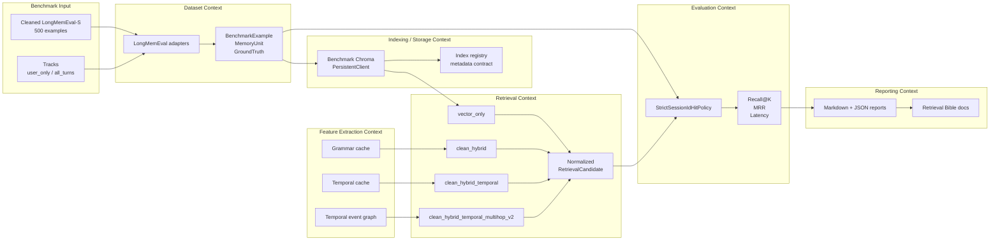
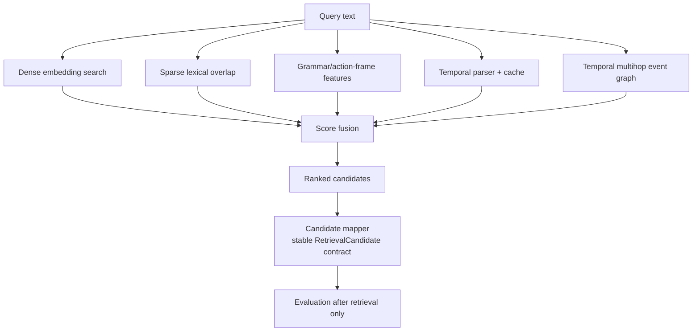
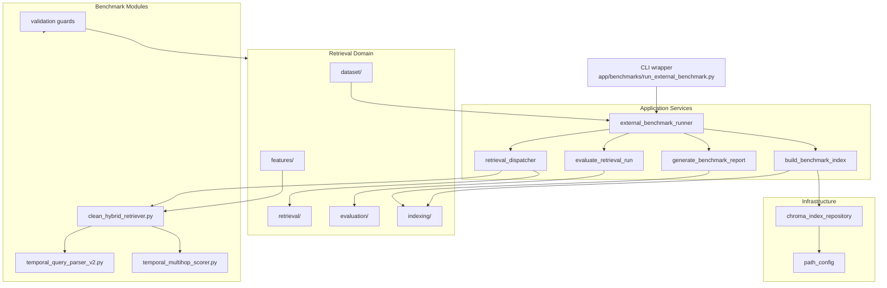
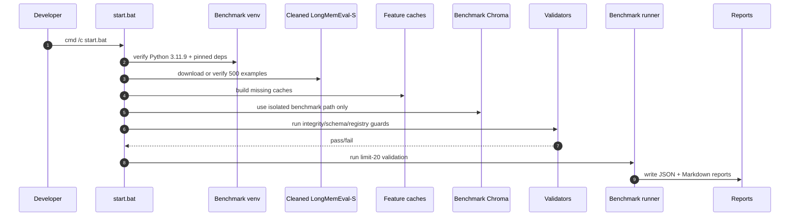
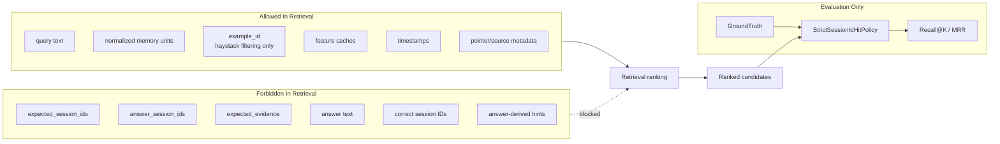

# Memory Retrieval Engine

Memory Retrieval Engine is a retrieval-focused benchmark and architecture
workspace for long-session memory search. It evaluates whether retrieval
strategies can find the correct session evidence from cleaned LongMemEval-S
examples using isolated Chroma storage, strict session-ID evaluation, and a
Domain-Driven Design refactor boundary around the benchmark system.

## Current Status

| Area | Status |
| --- | --- |
| Canonical benchmark | Cleaned LongMemEval-S, 500 examples |
| Best retrieval mode | `clean_hybrid_temporal_multihop_v2` |
| Primary CLI | `app/benchmarks/run_external_benchmark.py` |
| Bootstrap script | `start.bat` |
| Benchmark Chroma | isolated under `data/external/indexes/` |
| Production Chroma | protected; never opened by benchmark commands |
| Refactor style | DDD-aligned application/domain/infrastructure split |

## Benchmark Results

Current trusted best mode: `clean_hybrid_temporal_multihop_v2`.

| Track | Meaning | Recall@1 | Recall@5 | Recall@10 | MRR |
| --- | --- | ---: | ---: | ---: | ---: |
| `user_only` | Raw-compatible track using user turns only | 88.00% | 97.40% | 98.60% | 0.9204 |
| `all_turns` | Richer-context track using user + assistant turns | 82.00% | 95.60% | 98.00% | 0.8808 |

`user_only` is the closest raw apples-to-apples comparison track. `all_turns`
is the richer-context track and can be noisier because
assistant text is included in the indexed memory units.

Full cleaned-500 matrix:

| Track | Mode | Recall@1 | Recall@5 | Recall@10 | MRR | Avg latency | Indexed docs |
| --- | --- | ---: | ---: | ---: | ---: | ---: | ---: |
| `user_only` | `vector_only` | 82.20% | 96.40% | 98.80% | 0.8842 | 31.68 ms | 23,867 |
| `user_only` | `clean_hybrid` | 87.80% | 97.40% | 98.60% | 0.9198 | 29.93 ms | 23,867 |
| `user_only` | `clean_hybrid_temporal` | 87.80% | 97.40% | 98.60% | 0.9196 | 32.09 ms | 23,867 |
| `user_only` | `clean_hybrid_temporal_multihop_v2` | 88.00% | 97.40% | 98.60% | 0.9204 | 33.99 ms | 23,867 |
| `all_turns` | `vector_only` | 74.60% | 92.40% | 96.80% | 0.8252 | 29.41 ms | 23,867 |
| `all_turns` | `clean_hybrid` | 82.40% | 95.60% | 98.00% | 0.8824 | 36.93 ms | 23,867 |
| `all_turns` | `clean_hybrid_temporal` | 81.80% | 95.60% | 98.00% | 0.8790 | 37.11 ms | 23,867 |
| `all_turns` | `clean_hybrid_temporal_multihop_v2` | 82.00% | 95.60% | 98.00% | 0.8808 | 37.42 ms | 23,867 |

These metrics are embedded here for the public handoff repo. Full benchmark
runs regenerate machine-readable reports locally under `outputs/benchmarks/`;
that generated output directory is intentionally not committed. Latency may
vary by machine and run.

## System At A Glance



## Retrieval Modes

| Mode | Signals | Purpose |
| --- | --- | --- |
| `vector_only` | Dense embeddings | Baseline semantic retrieval |
| `clean_hybrid` | Dense + sparse + grammar metadata | Strong lexical/semantic hybrid ranking |
| `clean_hybrid_temporal` | Hybrid + temporal features | Better handling of time-sensitive questions |
| `clean_hybrid_temporal_multihop_v2` | Hybrid + temporal + event graph pair scoring | Best current mode for multi-event temporal retrieval |



Ground truth never enters retrieval. It is used only after ranked candidates are
returned, inside the Evaluation Context.

## DDD Architecture Map



The detailed architecture proposal is in
[docs/retrieval_bible/12_domain_driven_design_architecture.md](docs/retrieval_bible/12_domain_driven_design_architecture.md).

## Repository Structure

```text
app/benchmarks/                 Canonical CLI, validators, cache builders
app/retrieval_domain/           DDD-aligned retrieval domain packages
docs/retrieval_bible/           Active developer docs and runbooks
outputs/benchmarks/             Generated locally by validations and full runs
outputs/benchmarks/registry/    Generated index and feature-cache registries
marked_for_delete/              Ignored local deletion-staging folder, currently clear
```

Remaining top-level compatibility helpers are kept only because the active
retrieval import graph still reaches them:

```text
app/memory_retriever.py
app/hybrid_memory_retriever.py
app/dynamic_action_frame_extractor.py
app/paths.py
app/vector_store.py
```

## Canonical Benchmark Environment

Use the benchmark-only environment:

| Requirement | Value |
| --- | --- |
| Python | `3.11.9` |
| Chroma | `chromadb==0.6.3` |
| PostHog | `posthog<3` |
| Requirements file | `app/benchmarks/requirements_chroma063.txt` |
| Chroma path | `data/external/indexes/chroma_cleaned_500_py311_chroma063/` |
| Batch size | `50` |
| Chroma write API | `collection.add()` |

Never point benchmark commands at a production Chroma store.

## Quick Start

On Windows PowerShell:

```powershell
cmd /c start.bat
```

The start script restores the benchmark Python environment, installs pinned
dependencies, downloads the cleaned LongMemEval-S dataset if missing, builds
missing feature caches, runs guards, and runs a small validation.

```powershell
cmd /c start.bat --help
```

## Batch Files

This repository keeps two Windows batch files, and both are intentional:

| File | Role | Use it when |
| --- | --- | --- |
| `start.bat` | Full benchmark bootstrap and validation entry point | You are setting up the repo, downloading required benchmark assets, building missing caches, running guards, or launching validation/full benchmark runs |
| `setup_benchmark_env.bat` | Lower-level pinned environment installer | You only need to repair or verify Python `3.11.9`, `.venv_benchmark_chroma063`, `chromadb==0.6.3`, `posthog<3`, or run Chroma smoke/guard utilities |

Recommended path for most users:

```powershell
cmd /c start.bat
```

Use the lower-level setup script directly only for environment maintenance:

```powershell
cmd /c setup_benchmark_env.bat --help
cmd /c setup_benchmark_env.bat --smoke-test
cmd /c setup_benchmark_env.bat --guards
cmd /c setup_benchmark_env.bat --clear-chroma
```

`start.bat` calls `setup_benchmark_env.bat` internally, so you do not need to
run both manually during normal setup.

Useful options:

| Option | Purpose |
| --- | --- |
| `--skip-validation` | Prepare environment, dataset, and caches only |
| `--full-all-turns` | Run full cleaned-500 `all_turns` current-best mode |
| `--full-user-only` | Run full cleaned-500 `user_only` current-best mode |
| `--full-matrix` | Run all 8 canonical cleaned-500 cells |
| `--force-download` | Re-download cleaned LongMemEval-S |
| `--rebuild-caches` | Rebuild grammar, temporal, and event graph caches |
| `--rebuild-index` | Rebuild current-best benchmark Chroma collections |
| `--clear-chroma` | Clear only isolated benchmark Chroma |

## Benchmark Run Flow



## Validation Guards

Run these before benchmark or refactor work:

```powershell
$py = '.\.venv_benchmark_chroma063\Scripts\python.exe'
& $py app\benchmarks\validate_benchmark_integrity.py
& $py app\benchmarks\validate_candidate_schema.py
& $py app\benchmarks\validate_index_registry.py
& $py app\benchmarks\validate_feature_cache_registry.py
& $py app\benchmarks\validate_adapter_evaluation_boundary.py
```

| Guard | Protects |
| --- | --- |
| `validate_benchmark_integrity.py` | Blocks ground-truth leakage into retrieval |
| `validate_candidate_schema.py` | Keeps candidate output shape stable |
| `validate_index_registry.py` | Checks Chroma registry/path/metadata safety |
| `validate_feature_cache_registry.py` | Blocks incompatible cache reuse |
| `validate_adapter_evaluation_boundary.py` | Keeps dataset mapping separate from evaluation and retrieval |

## Safety Boundary



Core rules:

- Evaluation owns ground truth.
- Retrieval must never receive `answer_session_ids`, `expected_session_ids`,
  answer text, correct IDs, or answer-derived hints.
- `example_id` is allowed only for benchmark haystack filtering.
- Do not change retrieval scoring, evaluator metrics, candidate ranking, or
  Chroma storage behavior during documentation or cleanup work.
- Do not open production Chroma from benchmark code.
- Do not add an in-memory backend.

## Run Small Validation Manually

```powershell
$py = '.\.venv_benchmark_chroma063\Scripts\python.exe'

& $py app\benchmarks\run_external_benchmark.py --benchmark longmemeval_s --data-path data\external\longmemeval_cleaned --limit 20 --top-k 10 --mode clean_hybrid_temporal_multihop_v2 --skip-model-reload --use-existing-index --schema cleaned --turns-mode user_only --output-dir outputs\benchmarks\manual_validation\user_only

& $py app\benchmarks\run_external_benchmark.py --benchmark longmemeval_s --data-path data\external\longmemeval_cleaned --limit 20 --top-k 10 --mode clean_hybrid_temporal_multihop_v2 --skip-model-reload --use-existing-index --schema cleaned --turns-mode all_turns --output-dir outputs\benchmarks\manual_validation\all_turns
```

Expected small-run pattern:

| Track | Recall@1 | Recall@5 | Recall@10 | MRR |
| --- | ---: | ---: | ---: | ---: |
| `user_only` | about 95% | 100% | 100% | 0.9750 |
| `all_turns` | about 65% | 95% | 95% | 0.7667 |

## Run Full Cleaned-500 Matrix

Run all combinations of:

- tracks: `user_only`, `all_turns`
- modes: `vector_only`, `clean_hybrid`, `clean_hybrid_temporal`,
  `clean_hybrid_temporal_multihop_v2`

The easiest path is:

```powershell
cmd /c start.bat --full-matrix
```

Single-cell command template:

```powershell
$py = '.\.venv_benchmark_chroma063\Scripts\python.exe'

& $py app\benchmarks\run_external_benchmark.py --benchmark longmemeval_s --data-path data\external\longmemeval_cleaned --limit 500 --top-k 10 --mode clean_hybrid_temporal_multihop_v2 --skip-model-reload --use-existing-index --schema cleaned --turns-mode user_only --output-dir outputs\benchmarks\<run_name>\user_only\clean_hybrid_temporal_multihop_v2
```

Only run the full matrix after the canonical Python 3.11.9 environment is
restored and all guards pass.

## Where To Edit Common Tasks

| Task | Edit here |
| --- | --- |
| Add or change dataset schema | `app/retrieval_domain/dataset/` |
| Change evaluation hit policy | `app/retrieval_domain/evaluation/` |
| Change candidate output shape | `app/retrieval_domain/retrieval/candidate_mapper.py`, `app/retrieval_domain/retrieval_models.py` |
| Change Chroma storage behavior | `app/retrieval_domain/infrastructure/chroma_index_repository.py`, `app/retrieval_domain/indexing/` |
| Change temporal parser behavior | `app/benchmarks/temporal_query_parser_v2.py`, `app/retrieval_domain/features/temporal_versions.py` |
| Change grammar/action-frame extraction | `app/retrieval_domain/features/grammar_frame_extractor.py` |
| Change report generation | `app/retrieval_domain/applications/generate_benchmark_report.py` |
| Change CLI wrapper behavior | `app/benchmarks/run_external_benchmark.py` |
| Change benchmark workflow | `app/retrieval_domain/applications/external_benchmark_runner.py` |

## Documentation

- [Developer runbook](docs/retrieval_bible/13_developer_runbook.md)
- [Command cheatsheet](docs/retrieval_bible/15_command_cheatsheet.md)
- [Script inventory](docs/retrieval_bible/10_script_inventory.md)
- [Known issues and roadmap](docs/retrieval_bible/11_known_issues_and_refactor_roadmap.md)
- [DDD architecture](docs/retrieval_bible/12_domain_driven_design_architecture.md)
- [Retrieval modes](docs/retrieval_bible/04_retrieval_modes.md)
- [Adapters and schema](docs/retrieval_bible/05_adapters_and_schema.md)
- [Benchmark results](docs/retrieval_bible/06_benchmark_results.md)

## Artifact Policy

Benchmark evidence and validator-required registries are generated locally
under `outputs/benchmarks/` when validations or full runs are executed. That
directory is ignored for the public handoff repo.

Historical findings, raw logs, ablation artifacts, and old exploratory outputs
that are not required by active validators or the canonical benchmark path can
be staged under `marked_for_delete/` during cleanup. That folder is ignored and
has been cleared for repo handoff.

## Current Limitations And Future Work

- Some existing cache files were created before full provenance manifests
  existed, so their metadata is reconstructed from filenames, hashes, registry
  records, and the current canonical setup. Future cache builds should write
  explicit provenance at creation time.
- The richer-context `all_turns` track can add useful context but also adds
  retrieval noise.
- Noun-phrase-only temporal event comparisons remain limited.
- LoCoMo is not canonical yet.
- No LLM reranker or reader layer is implemented.
- Remaining top-level retrieval helpers should be migrated gradually into
  retrieval-owned modules after validation gates pass.
