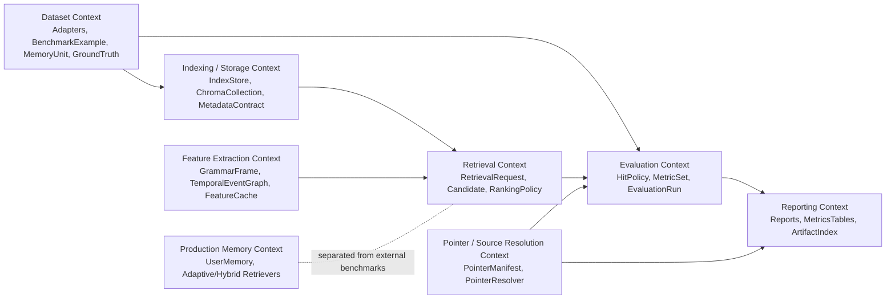

# Domain-Driven Design Architecture Proposal

## Purpose

This proposal defines a future DDD architecture for Memory Retrieval Engine
retrieval and benchmarking. It is a design document only. It does not move
files, change scoring, change benchmark logic, or authorize production Chroma
access.

The design is grounded in the current Retrieval Bible, the canonical cleaned
LongMemEval-S Chroma 0.6.3 artifacts, and code inspection of the current
`app/benchmarks/` implementation.

## Current Baseline

| Item | Current value |
| --- | --- |
| Canonical external benchmark | Cleaned LongMemEval-S, 500 examples |
| Canonical environment | Python `3.11.9`, `chromadb==0.6.3`, `posthog<3` |
| Canonical Chroma path | `data/external/indexes/chroma_cleaned_500_py311_chroma063/` |
| Batch size | `50` |
| Corrected best `user_only` row | `clean_hybrid_temporal_multihop_v2`, R@1 `88.00%`, R@5 `97.40%`, R@10 `98.60%`, MRR `0.9204` |
| Corrected `all_turns` multihop-v2 row | `clean_hybrid_temporal_multihop_v2`, R@1 `82.00%`, R@5 `95.60%`, R@10 `98.00%`, MRR `0.8808` |

Important: the pre-integrity 99.0% `user_only` Recall@5 result is superseded.
Phase 1 removed the clean-hybrid-family benchmark path that passed
ground-truth-derived session/evidence hints into retrieval. DDD separation must
keep this impossible by construction: Evaluation owns ground truth, Retrieval
does not.

## Ubiquitous Language

| Term | Definition | Context | Current example | DDD kind |
| --- | --- | --- | --- | --- |
| DatasetSource | Physical or logical source of examples, such as cleaned LongMemEval-S JSON | Dataset | `data/external/longmemeval_cleaned/longmemeval_s_cleaned.json` | Value Object |
| DatasetSchema | Contract describing raw source fields and interpretation | Dataset | `schema="cleaned"` / `schema="default"` | Value Object |
| DatasetAdapter | Translates raw source data into normalized examples | Dataset | `LongMemEvalAdapter` | Domain Service / ACL |
| BenchmarkExample | Normalized query plus memory units and ground truth | Dataset / Evaluation | `BenchmarkExample` dataclass | Entity |
| MemoryUnit | Normalized memory text plus stable identity and metadata | Dataset / Retrieval / Indexing | cleaned haystack session unit | Entity |
| GroundTruth | Expected IDs or evidence used only by evaluation | Evaluation | `answer_session_ids` -> `expected_session_ids` | Value Object |
| RetrievalMode | Named retrieval strategy | Retrieval | `vector_only`, `clean_hybrid_temporal_multihop_v2` | Value Object |
| RetrievalRequest | Query, mode, target index, and optional feature handles | Retrieval | `run_retrieval(...)` arguments | Value Object |
| RetrievalCandidate | Ranked memory candidate returned by retrieval | Retrieval / Evaluation | candidate dict from retriever | Entity |
| ScoreBreakdown | Per-signal scores and final fused score | Retrieval | `dense_raw`, `sparse_raw`, `temporal_pair_score` | Value Object |
| RankingPolicy | Fixed scoring/fusion policy for a mode | Retrieval | clean-hybrid weights | Domain Service |
| FeatureCache | Versioned extracted signal store | Feature Extraction | grammar cache, temporal cache | Repository-backed Aggregate |
| GrammarFrame | Extracted action/grammar signal | Feature Extraction | grammar cache frame | Value Object |
| TemporalEvent | Extracted date/event signal from text | Feature Extraction | temporal cache event | Entity |
| TemporalEventGraph | Event cards and graph links for multihop scoring | Feature Extraction | `longmemeval_s_temporal_event_graph.json` | Aggregate |
| PointerId | Stable source-reference identifier | Pointer Resolution | `pointer_id` metadata | Value Object |
| PointerManifest | Manifest mapping pointers to source spans and hashes | Pointer Resolution | `pointer_manifest.json` | Aggregate |
| SourceSpan | Exact source location and hash | Pointer Resolution | manifest entry | Value Object |
| IndexStore | Storage abstraction for embeddings/sparse records | Indexing / Storage | Chroma persistent collection | Repository |
| ChromaCollection | Concrete Chroma collection handle and metadata contract | Indexing / Storage | `longmemeval_s_cleaned_user_only_...` | Infrastructure Entity |
| MetadataContract | Allowed metadata keys and value types | Indexing / Storage | primitive metadata list | Value Object |
| EvaluationRun | A completed benchmark run with mode, track, config, and results | Evaluation | final cleaned-500 JSON | Aggregate |
| MetricSet | Aggregated metrics for a run/mode | Evaluation | Recall@K, MRR, latency | Value Object |
| HitPolicy | Rule for deciding whether a candidate matches ground truth | Evaluation | cleaned strict session ID matching | Domain Service |
| BenchmarkReport | Human-readable or machine-readable reporting artifact | Reporting | final Markdown/JSON reports | Entity |
| ProductionMemory | Runtime memory representation outside the external benchmark path | Production Memory | active memory data | Entity |
| AdaptiveRetriever | Production retrieval strategy | Production Memory | `app/adaptive_memory_retriever.py` | Domain/Application Service |

## Bounded Contexts

### 1. Dataset Context

Responsibility: load raw external/internal datasets and expose normalized
examples.

Contains:

- `DatasetSource`
- `DatasetSchema`
- `DatasetAdapter`
- `BenchmarkExample`
- `MemoryUnit`
- `GroundTruth`

Boundary rule: Dataset code must not know retrieval scoring, Chroma, BM25,
temporal scoring, or report formatting. It only maps source data into
normalized domain objects.

Current files:

- `app/benchmarks/longmemeval_s_adapter.py`
- `app/retrieval_domain/dataset/json_dataset_repository.py`
- `app/retrieval_domain/dataset/longmemeval_cleaned_adapter.py`
- `app/retrieval_domain/dataset/longmemeval_legacy_adapter.py`
- `app/retrieval_domain/dataset/longmemeval_adapter_facade.py`
- `app/benchmarks/external_benchmark_adapter.py`
- `app/benchmarks/schema_exploration/longmemeval/*.py`

### 2. Retrieval Context

Responsibility: rank memory candidates for a query.

Contains:

- `RetrievalMode`
- `RetrievalRequest`
- `RetrievalCandidate`
- `ScoreBreakdown`
- `RankingPolicy`

Boundary rule: Retrieval should not know dataset-specific fields like
`haystack_sessions` or `answer_session_ids`. It receives normalized
`MemoryUnit` records or index candidates and returns ranked candidates.

Canonical modes:

- `vector_only`
- `clean_hybrid`
- `clean_hybrid_temporal`
- `clean_hybrid_temporal_multihop_v2`

### 3. Evaluation Context

Responsibility: measure retrieval quality against ground truth.

Contains:

- `EvaluationRun`
- `EvaluationResult`
- `MetricSet`
- `HitPolicy`
- `RecallAtK`
- `MRR`
- `NDCG` if later supported

Boundary rule: Evaluation must not influence retrieval. It compares candidate
IDs against `GroundTruth` only. For cleaned LongMemEval-S, ground truth is
`answer_session_ids`. For the old 147 path, fuzzy mapping is legacy evaluation
setup only.

This context is where expected-session IDs are consumed after retrieval, never
before or during ranking.

Phase 6 introduces the first concrete Evaluation Context services:

- `StrictSessionIdHitPolicy` owns cleaned LongMemEval-S exact session matching;
- `LegacyFuzzyEvidenceSetupPolicy` labels the old 147-path fuzzy setup as
  non-canonical;
- `MetricAggregator` preserves the existing Recall@1/5/10 and MRR formulas;
- `EvaluationService` coordinates policy and metrics after retrieval returns.

### 4. Indexing / Storage Context

Responsibility: persist and query embeddings, sparse indexes, and benchmark
Chroma collections.

Contains:

- `IndexStore`
- `ChromaCollection`
- `IndexBuildConfig`
- `PersistPath`
- `CollectionName`
- `MetadataContract`

Boundary rule: Storage must not decide ranking meaning. It stores/retrieves
raw candidates and metadata. It must stay isolated from production DB for
external benchmarks.

Canonical storage rules:

- benchmark Chroma path only:
  `data/external/indexes/chroma_cleaned_500_py311_chroma063/`;
- `chromadb==0.6.3`;
- batch size `50`;
- use `collection.add()`, not `upsert()`;
- primitive metadata only;
- source text as document text.

### 5. Feature Extraction Context

Responsibility: extract reusable signals from memory/query text.

Contains:

- `GrammarFrame`
- `TemporalEvent`
- `TemporalEventGraph`
- `EmotionFrame`
- `PointerReference`
- `FeatureCache`

Boundary rule: Feature extraction creates signals, not final rankings. It
should not directly evaluate correctness. Retrieval consumes features through
clear interfaces.

Relevant current components:

- `temporal_query_parser.py`
- `temporal_query_parser_v2.py`
- `temporal_multihop_scorer.py`
- grammar cache builder
- temporal cache builder
- event graph builder

### 6. Pointer / Source Resolution Context

Responsibility: map retrieved candidates back to exact source text.

Contains:

- `PointerId`
- `SourcePointer`
- `PointerManifest`
- `PointerResolver`
- `SourceSpan`

Boundary rule: Pointer system should not rank candidates. It provides source
traceability and exact text resolution. Candidate output may carry
`pointer_id`, but retrieval should remain backward-compatible.

### 7. Reporting Context

Responsibility: produce benchmark reports and documentation artifacts.

Contains:

- `BenchmarkReport`
- `ArtifactIndex`
- `MetricsTable`
- `ComparisonReport`
- `FailureReport`

Boundary rule: Reports must not run retrieval logic directly. Reports consume
result JSON or `EvaluationResult` objects.

### 8. Production Memory Context

Responsibility: actual runtime memory retrieval outside the external benchmark
path.

Contains:

- `ProductionMemory`
- `UserMemory`
- `AdaptiveRetriever`
- `HybridMemoryRetriever`

Boundary rule: External benchmark code must not modify production memory DB or
production retrieval behavior. Benchmark modules are allowed to compare
against production concepts, but must not directly mutate production DB.

## Bounded Context Diagram



Interpretation:

- Dataset prepares normalized examples and ground truth.
- Indexing stores normalized memory units and returns raw indexed records.
- Feature Extraction creates caches consumed by Retrieval.
- Retrieval ranks; Evaluation measures; Reporting renders.
- Pointer Resolution provides source traceability without ranking.
- Production Memory is explicitly separated from External Benchmarking.

## Entities And Value Objects

### Entities

| Entity | Identity | Notes |
| --- | --- | --- |
| `BenchmarkExample` | `ExampleId` | Query plus memory units and ground truth |
| `EvaluationRun` | Run ID / config hash | Aggregate over results for one benchmark config |
| `MemoryUnit` | `MemoryId` plus `original_memory_id` | Normalized memory/session/turn record |
| `RetrievalCandidate` | `MemoryId` | Ranked candidate with source fields and score |
| `PointerManifest` | Manifest path/version | Aggregate of pointer entries |
| `TemporalEventGraph` | Graph cache path/version | Aggregate of event cards and links |

### Value Objects

| Value Object | Notes |
| --- | --- |
| `ExampleId` | Dataset-stable example identity |
| `SessionId` | Ground-truth and candidate matching key |
| `MemoryId` | Index/storage identity |
| `PointerId` | Source-resolution identity |
| `ScoreBreakdown` | Immutable per-candidate score components |
| `MetricSet` | Recall/MRR/latency values |
| `Timestamp` | Memory or query time |
| `CollectionName` | Validated Chroma collection identifier |
| `PersistPath` | Validated benchmark/production storage path |

## Aggregates

| Aggregate | Root | Invariants |
| --- | --- | --- |
| Benchmark Example Aggregate | `BenchmarkExample` | Memory units and ground truth stay attached to one source example |
| Index Build Aggregate | `IndexBuildConfig` | Persist path, collection name, metadata contract, Chroma version, batch size stay consistent |
| Evaluation Run Aggregate | `EvaluationRun` | Metrics derive only from candidate results and ground truth |
| Feature Cache Aggregate | `FeatureCache` | Cache version and dataset/schema/turns mode match the run |
| Pointer Manifest Aggregate | `PointerManifest` | Pointer IDs map to stable source spans and hashes |

## Domain Services

| Service | Context | Responsibility |
| --- | --- | --- |
| `RetrievalScoringService` | Retrieval | Apply mode-specific fixed ranking policy |
| `TemporalPairScoringService` | Feature Extraction / Retrieval | Score event target pairs and graph bonuses |
| `GrammarMatchingService` | Feature Extraction / Retrieval | Compare query grammar frame to cached memory frames |
| `HitEvaluationService` | Evaluation | Apply hit policy without altering candidates |
| `MetricAggregationService` | Evaluation | Compute Recall@K, MRR, latency summaries, future NDCG |

## Application Services

| Application Service | Orchestrates | Current equivalent |
| --- | --- | --- |
| `RunBenchmarkSuite` | Dataset -> Indexing -> Retrieval -> Evaluation -> Reporting | `run_external_benchmark.py` |
| `BuildBenchmarkIndex` | Dataset -> Indexing | ingestion portion of `run_external_benchmark.py` |
| `ExternalBenchmarkRunner` | CLI workflow -> application services | Phase 7 runner extraction |
| `retrieval_dispatcher.run_retrieval` | Mode dispatch -> existing scoring functions | Phase 7 dispatch extraction |
| `ValidateAdapter` | Dataset -> Evaluation sanity checks | adapter validation reports/scripts |
| `GenerateReport` | Evaluation results -> Reporting artifacts | report-writing sections and current final report generation |

Application services should coordinate contexts. They should not contain
ranking math, schema mapping details, or Chroma-specific persistence logic.

## Repositories And Infrastructure

| Repository / Adapter | Context | Current equivalent |
| --- | --- | --- |
| `DatasetRepository` | Dataset | JSON file loading in adapters |
| `ChromaIndexRepository` | Indexing / Storage | direct `chromadb.PersistentClient` and collection usage |
| `FeatureCacheRepository` | Feature Extraction | grammar/temporal/event graph JSON files |
| `PointerManifestRepository` | Pointer Resolution | pointer manifest JSON loader/writer |
| `ResultsRepository` | Reporting / Evaluation | final JSON and Markdown outputs |

Infrastructure adapters should be replaceable without changing domain rules.
For example, Chroma-specific collection restrictions belong in
`ChromaIndexRepository`, not inside `RetrievalScoringService`.

## Anti-Corruption Layers

### A. LongMemEval Cleaned Adapter

Maps raw cleaned dataset fields to domain objects:

| Source field | Domain field |
| --- | --- |
| `question_id` | `ExampleId` / `example_id` |
| `question` | `query` |
| `answer_session_ids` | `GroundTruth.expected_session_ids` |
| `haystack_sessions` | `MemoryUnit` collection |
| `haystack_session_ids` | `session_id`, `source_session_id`, `original_memory_id` |
| `haystack_dates` | `MemoryUnit.timestamp` |

`question_date` should become a query timestamp value object in the refactor;
it is not currently surfaced by the adapter.

### B. Chroma Benchmark Adapter

Maps normalized `MemoryUnit` objects to:

- Chroma document text: `source_text`;
- primitive metadata only:
  `example_id`, `memory_id`, `original_memory_id`, `session_id`,
  `source_session_id`, `pointer_id`, `timestamp`, `memory_unit_type`,
  `turns_mode`;
- stable collection names with the `ch_temporal_mh_v2` alias where required.

This adapter must reject production persist paths.

### C. Candidate Mapper

Maps Chroma query results back to stable retrieval candidates:

```text
memory_id
original_memory_id
session_id
source_session_id
source_text
score
final_score
pointer_id
```

The mapper should not decide whether the candidate is correct and should not
receive ground truth.

## Current File Mapping

| Current file | Proposed context | Status | Refactor note |
| --- | --- | --- | --- |
| `app/benchmarks/run_external_benchmark.py` | CLI wrapper | Canonical | Phase 7 reduced this to thin wrapper and compatibility exports |
| `app/benchmarks/longmemeval_s_adapter.py` | Compatibility wrapper | Canonical | Phase 8 delegates to Dataset Context facade |
| `app/retrieval_domain/dataset/ports.py` | Dataset Context | Supporting | Dataset adapter/repository protocols |
| `app/retrieval_domain/dataset/json_dataset_repository.py` | Dataset Context / Repository | Supporting | Raw JSON loading and hashing only |
| `app/retrieval_domain/dataset/longmemeval_cleaned_adapter.py` | Dataset Context / LongMemEval ACL | Supporting | Cleaned 500-example mapping; no fuzzy matching |
| `app/retrieval_domain/dataset/longmemeval_legacy_adapter.py` | Dataset Context / Legacy setup | Supporting | Default 147-example mapping and non-canonical fuzzy evidence setup |
| `app/retrieval_domain/dataset/longmemeval_adapter_facade.py` | Dataset/Evaluation compatibility facade | Supporting | Preserves current runner API and cleaned evaluation delegation |
| `app/benchmarks/external_benchmark_adapter.py` | Dataset and Evaluation shared models | Canonical | Replace generic dicts with explicit domain models |
| `app/benchmarks/clean_hybrid_retriever.py` | Retrieval Context | Canonical | Ground-truth hint removed; keep integrity guard active |
| `app/benchmarks/validate_benchmark_integrity.py` | Evaluation/Retrieval boundary validation | Canonical | Static guard for benchmark integrity |
| `app/retrieval_domain/*.py` | Domain contracts | Supporting | Phase 1 contract layer; not yet wired into runners |
| `app/retrieval_domain/applications/build_benchmark_index.py` | Application Services / Indexing | Supporting | Phase 2 service for isolated benchmark collection setup and add ingestion |
| `app/retrieval_domain/applications/run_benchmark_suite.py` | Application Services | Supporting | Phase 2 service for retrieval/evaluation loop orchestration |
| `app/retrieval_domain/applications/evaluate_retrieval_run.py` | Application Services / Evaluation | Supporting | Phase 2 service wrapping existing evaluator calls and diagnostics |
| `app/retrieval_domain/applications/generate_benchmark_report.py` | Application Services / Reporting | Supporting | Phase 2 service for Markdown/JSON report generation |
| `app/retrieval_domain/applications/external_benchmark_runner.py` | Application Services | Supporting | Phase 7 end-to-end benchmark workflow orchestration |
| `app/retrieval_domain/applications/retrieval_dispatcher.py` | Application Services / Retrieval dispatch | Supporting | Phase 7 dispatch wrapper; scoring remains in existing retrievers |
| `app/retrieval_domain/retrieval/candidate_mapper.py` | Retrieval Context / Candidate ACL | Supporting | Phase 3 normalization for vector, hybrid, temporal, multihop, and pointer-aware candidates |
| `app/benchmarks/validate_candidate_schema.py` | Retrieval/Evaluation boundary validation | Canonical | Tiny cleaned schema validation for candidate contract and evaluator dict compatibility |
| `app/retrieval_domain/indexing/*.py` | Indexing / Storage Context | Supporting | Phase 4 metadata contract, collection-name policy, and registry models/IO |
| `app/retrieval_domain/infrastructure/chroma_index_repository.py` | Infrastructure Adapter | Supporting | Phase 4 benchmark-only Chroma repository for client creation, collection lifecycle, add ingestion, and count validation |
| `app/benchmarks/validate_index_registry.py` | Indexing / Storage validation | Canonical | Validates registry JSON, paths, metadata contract, Chroma version, counts, cache paths, and artifacts |
| `app/retrieval_domain/features/*.py` | Feature Extraction Context | Supporting | Phase 5 feature-cache identity, temporal/parser version labels, compatibility validation, and registry IO |
| `app/benchmarks/validate_feature_cache_registry.py` | Feature Extraction validation | Canonical | Validates feature cache registry and fails incompatible cache usage before retrieval |
| `app/retrieval_domain/evaluation/*.py` | Evaluation Context | Supporting | Phase 6 hit policies, metric aggregation, and evaluation service |
| `app/benchmarks/validate_adapter_evaluation_boundary.py` | Dataset/Evaluation/Retrieval boundary validation | Canonical | Ensures adapters avoid retrieval/storage imports, cleaned path avoids fuzzy setup, and evaluation does not mutate scores |
| `app/benchmarks/chroma_smoke_test.py` | Indexing / Storage validation | Canonical | Keep as infrastructure smoke test |
| `app/benchmarks/requirements_chroma063.txt` | Infrastructure configuration | Canonical | Keep benchmark-only |
| `app/benchmarks/temporal_query_parser.py` | Feature Extraction | Supporting | Base temporal extraction dependency |
| `app/benchmarks/temporal_query_parser_v2.py` | Feature Extraction | Canonical | Multihop-v2 parser |
| `app/benchmarks/temporal_multihop_scorer.py` | Feature Extraction / Retrieval service boundary | Canonical | Clarify whether pair scoring is feature generation or ranking input |
| `app/benchmarks/build_grammar_cache.py` | Feature Extraction / cache repository | Supporting | Move cache provenance into registry |
| `app/benchmarks/build_temporal_cache.py` | Feature Extraction / cache repository | Supporting | Same |
| `app/benchmarks/build_temporal_event_graph.py` | Feature Extraction / graph repository | Supporting | Same |
| `app/benchmarks/pointer_manifest.py` | Pointer / Source Resolution | Supporting | Extend cleaned pointer format |
| `app/benchmarks/pointer_resolver.py` | Pointer / Source Resolution | Supporting | Keep ranking-independent |
| `app/benchmarks/validate_pointer_manifest.py` | Pointer / Source Resolution validation | Supporting | Good application-service candidate |
| `app/benchmarks/locomo_adapter.py` | Dataset Context | Experimental | Not canonical yet |
| `app/benchmarks/run_temporal_multihop_v2_full.py` | Experimental/Legacy Application Service | Legacy | Preserve for history; repair or archive later |
| `app/benchmarks/run_targeted_multihop_diagnostic.py` | Experimental/Legacy diagnostics | Legacy | Preserve for history; repair or archive later |
| `app/benchmarks/smoke_test_runner.py` | Old smoke runner | Archive candidate | Superseded by Chroma smoke and canonical runner |
| `app/benchmarks/schema_exploration/longmemeval/*.py` | Dataset Context support | Supporting | Keep as source-discovery tools |
| `app/memory_retriever.py` | Production Memory / shared infrastructure | Production | Benchmark should depend only through explicit interfaces |
| `app/hybrid_memory_retriever.py` | Production Memory / shared sparse helpers | Production | Extract reusable scoring primitives carefully |
| `app/adaptive_memory_retriever.py` | Production Memory | Production | Must not depend on benchmark modules |

## Refactor Boundary Rules

1. Dataset adapters cannot import retrievers.
2. Dataset adapters cannot import Chroma or storage repositories.
3. Evaluators cannot alter candidate scores.
4. Evaluation ground truth cannot enter a `RetrievalRequest`.
5. Feature extractors cannot access Chroma directly.
6. Feature extractors cannot decide hit correctness.
7. Benchmark storage cannot access production DB.
8. Production retrieval cannot depend on benchmark modules.
9. Reports must consume result artifacts or `EvaluationResult` objects, not run
   retrieval logic directly.
10. Pointer resolution cannot affect ranking unless an explicitly named future
   ranking policy is introduced and separately evaluated.
11. Collection names and persist paths must be validated value objects before
   infrastructure use.
12. Legacy fuzzy evidence mapping must remain an Evaluation setup concern for
   the old 147 path only.

## Proposed Future Folder Structure

Do not implement this yet. This is a target structure for a staged refactor.

```text
app/retrieval_domain/
  dataset/
    models.py
    adapters/
      longmemeval_cleaned.py
      longmemeval_legacy.py
      locomo.py
  retrieval/
    models.py
    modes.py
    ranking_policies.py
    scoring_services.py
  evaluation/
    models.py
    hit_policies.py
    metrics.py
  indexing/
    models.py
    metadata_contracts.py
    collection_names.py
  features/
    grammar.py
    temporal.py
    temporal_graph.py
    caches.py
  pointers/
    models.py
    manifest.py
    resolver.py
  reporting/
    reports.py
    tables.py
  infrastructure/
    chroma_repository.py
    json_dataset_repository.py
    file_results_repository.py
    feature_cache_repository.py
  applications/
    run_benchmark_suite.py
    build_benchmark_index.py
    validate_adapter.py
    generate_report.py
```

Production retrieval may later receive a parallel production-domain structure,
but the first step should be to isolate benchmark contexts without changing
production behavior.

## Migration Plan

### Phase 0: Freeze Current Docs And Benchmark Results

- Treat the Retrieval Bible and DDD proposal as the baseline.
- Treat pre-integrity results as historical; use
  `benchmark_integrity_fix_results.json` for corrected comparison claims.
- Keep production validation snapshot-based.

### Phase 1: Define Domain Models / Dataclasses

- Introduce `BenchmarkExample`, `MemoryUnit`, `GroundTruth`,
  `RetrievalRequest`, `RetrievalCandidate`, `ScoreBreakdown`, `MetricSet`,
  `BenchmarkRunConfig`, `CollectionName`, and `PersistPath` domain classes.
- Add tests that ground truth cannot be passed into retrieval requests.
- Preserve runtime retrieval behavior; do not migrate runners in this phase.

### Phase 2: Isolate Dataset Adapters

Current Phase 2 status: benchmark orchestration extraction has started before
full adapter migration. `run_external_benchmark.py` remains the CLI wrapper and
delegates isolated index building, retrieval/evaluation loop orchestration, and
report writing to `app/retrieval_domain/applications/` services. Scoring,
adapter mapping, evaluator metrics, and cache loading remain unchanged.

Next adapter-focused work:

- Move LongMemEval cleaned/default mapping behind explicit ACL adapters.
- Preserve the legacy fuzzy path only as evaluation setup.
- Surface `question_date` as a query timestamp if needed.

### Phase 3: Isolate Evaluation Metrics

Current Phase 3 status: candidate schema normalization has started before full
metric isolation. All canonical benchmark retrieval paths normalize through
`RetrievalCandidate` and `candidate_mapper.py` before evaluation. Existing
evaluators still receive dict-compatible `candidate.to_dict()` output, so hit
policy and metric behavior remain unchanged.

Normalized candidate contract:

- `memory_id`
- `original_memory_id`
- `session_id`
- `source_session_id`
- `pointer_id`
- `source_text`
- `summary`
- `dia_ids`
- `score`
- `final_score`
- `score_breakdown`
- `metadata`

Forbidden candidate fields:

- `expected_session_ids`
- `answer_session_ids`
- `expected_evidence`
- `query_session_id`
- `query_evidence_ids`
- `_query_evidence_ids`
- `answer`
- `correct_session_id`

Next evaluation-focused work:

- Move strict cleaned hit policy and legacy fuzzy setup into Evaluation.
- Ensure evaluators cannot mutate candidate scores or order.
- Add optional NDCG only if a ranked relevance contract is defined.

### Phase 4: Isolate Chroma Infrastructure

Current Phase 4 status: `ChromaIndexRepository`, `MetadataContract`,
`CollectionNamePolicy`, and registry models/IO are implemented.
`BuildBenchmarkIndex` delegates benchmark-only client creation, path rejection,
collection create/reuse, `collection.add()` ingestion, unique ID checks,
primitive metadata validation, and count validation to the infrastructure
repository.

Registry artifacts are written to:

- `outputs/benchmarks/registry/longmemeval_s_cleaned_user_only_registry.json`
- `outputs/benchmarks/registry/longmemeval_s_cleaned_all_turns_registry.json`

The metadata contract allows only:

- `example_id`
- `memory_id`
- `original_memory_id`
- `session_id`
- `source_session_id`
- `pointer_id`
- `timestamp`
- `memory_unit_type`
- `turns_mode`

The collection-name policy enforces Chroma 0.6.3 limits and preserves the
`ch_temporal_mh_v2` alias for
`clean_hybrid_temporal_multihop_v2`.

Remaining storage work:

- Restore canonical Python 3.11.9 benchmark runtime before full cleaned-500
  reruns.
- Record a real Chroma smoke-test status in the registry.
- Promote cache provenance/version compatibility into a stronger Phase 5
  temporal/cache registry.

### Phase 5: Isolate Feature Extraction

Current Phase 5 status: feature cache provenance and compatibility are now
explicit. The feature registry records grammar, temporal, temporal event graph,
and pointer manifest identities with cache paths, hashes, version labels,
builder scripts, parser labels, dataset hash, cache counts, source artifacts,
validation status, and warnings.

Current version labels:

- `temporal_query_parser.py` -> `temporal_parser_v1`
- `temporal_query_parser_v2.py` -> `temporal_parser_v2_relcl_acl`
- `temporal_multihop_scorer.py` -> `temporal_multihop_scorer_v2`
- grammar cache builder -> `grammar_cache_v1`
- temporal cache builder -> `temporal_cache_v1`
- temporal event graph builder -> `temporal_event_graph_v1`
- pointer manifest builder -> `pointer_manifest_v1_legacy`

`run_external_benchmark.py` calls a feature-cache preflight before retrieval.
For `clean_hybrid_temporal_multihop_v2`, the preflight requires grammar cache,
temporal cache, temporal graph provenance, and parser version
`temporal_parser_v2_relcl_acl`. Unknown dataset/schema/turns provenance is
reported as a warning because the current cache files do not embed complete
provenance.

Feature extraction remains ranking-independent; parser extraction, temporal
scoring, and multihop gates were not changed.

Remaining feature work:

- Move grammar, temporal, temporal graph, and parser services behind feature
  interfaces.
- Embed full provenance in newly built cache files.
- Promote pointer manifest cleaned-schema compatibility beyond legacy labels.

### Phase 6: Isolate Adapter And Evaluation

Current Phase 6 status: cleaned LongMemEval-S strict hit logic has moved from
inline adapter code to the Evaluation Context. `LongMemEvalAdapter` still owns
raw dataset mapping and remains a compatibility wrapper for callers, but
`StrictSessionIdHitPolicy` now owns candidate-vs-ground-truth matching.

Legacy fuzzy evidence derivation is isolated as
`LegacyFuzzyEvidenceSetupPolicy` for the old default 147 path and is not used
for `schema="cleaned"`.

The new boundary validator confirms:

- dataset adapters do not import retrievers or Chroma infrastructure;
- cleaned LongMemEval-S does not call fuzzy evidence setup;
- hit policies do not import retrievers or Chroma;
- retrieval modules do not import Evaluation-owned `GroundTruth`/`HitPolicy`;
- evaluation modules do not mutate candidate scores.

### Phase 7: Migrate Benchmark Runner Into Application Service

Current Phase 7 status: `app/benchmarks/run_external_benchmark.py` is now a
thin CLI wrapper with compatibility exports. The workflow moved into
`ExternalBenchmarkRunner`, which coordinates dataset loading, cache
preparation, feature preflight, benchmark-only Chroma indexing, retrieval loop,
report generation, and registry writing.

`retrieval_dispatcher.py` owns mode dispatch for vector, legacy exploratory
modes, and clean-hybrid-family modes, but it does not alter scoring formulas.
Scoring remains in `clean_hybrid_retriever.py`, production helper retrievers,
and temporal scorer modules.

Phase 7 limit-20 cleaned LongMemEval-S validations passed for `user_only` and
`all_turns` multihop-v2 through the thin wrapper.

### Phase 8: Split Dataset Context Adapters

Current Phase 8 status: LongMemEval raw data handling has been split into
Dataset Context components. The cleaned adapter maps the 500-example schema,
including `question_id`, `question`, `answer_session_ids`,
`haystack_sessions`, `haystack_session_ids`, `haystack_dates`, `question_date`,
and `question_type`, without fuzzy matching. The legacy adapter owns the old
default `documents` schema and is the only allowed home for fuzzy evidence
setup.

`LongMemEvalAdapterFacade` preserves the runner-facing API and delegates
cleaned strict evaluation to the Evaluation Context. The benchmark module
`app/benchmarks/longmemeval_s_adapter.py` is now only a thin import wrapper.

Boundary validation now checks the new dataset package for forbidden retrieval
or Chroma dependencies and ensures cleaned mapping cannot call fuzzy evidence
setup.

### Phase 9: Remove / Archive Legacy Scripts

- Do not delete immediately.
- Repair, archive, or replace older diagnostic runners after canonical
  application services exist.
- Maintain a migration index for reproducibility.

### Phase 10: Add LoCoMo Canonical Evaluation

- Freeze LoCoMo schema, pointer behavior, unit type, storage config, and
  metrics.
- Resolve composite pointer caveats before marking it canonical.

### Phase 11: Optional LLM Reranker / Reader Layer

- Add as a separate bounded policy, not as hidden retrieval behavior.
- Compare only to equivalent LLM-assisted baselines.
- Keep raw retrieval metrics separately reported.

## Risks

| Risk | Mitigation |
| --- | --- |
| Accidental production DB access | Persist-path value object, repository guard, snapshot-only production validation |
| Chroma version fragility | Versioned infrastructure config and fresh benchmark-only stores |
| Benchmark logic leaking into production | One-way dependency rule: benchmarks may import stable interfaces, production cannot import benchmark modules |
| Score/evaluator coupling | Evaluation owns ground truth; RetrievalRequest excludes expected IDs |
| Mode explosion | Register modes with explicit status and required feature contracts |
| Duplicate candidate schemas | Single `RetrievalCandidate` domain model plus mappers |
| Cache invalidation problems | Feature cache registry with dataset/schema/turns/mode/version provenance |
| Old fuzzy-matching confusion | Legacy context label and separate hit-policy setup |
| Pointer-format mismatch | Normalize pointer ID contracts before deferred source resolution |
| Reporting re-running logic | Reports consume persisted results only |

## Success Criteria For The Refactor

- A cleaned benchmark run can be executed through application services without
  dataset adapters importing retrieval code.
- Retrieval ranking receives no ground truth.
- Evaluation metrics reproduce canonical result artifacts after intentional
  rerun.
- Chroma storage guards reject production paths and incompatible stores.
- Production retrieval behavior remains unchanged unless a separate production
  refactor is explicitly approved.

## References

- [README](./README.md)
- [Current system state](./01_current_system_state.md)
- [Canonical benchmark environment](./02_canonical_benchmark_environment.md)
- [Evaluation tracks](./03_evaluation_tracks.md)
- [Retrieval modes](./04_retrieval_modes.md)
- [Benchmark results](./06_benchmark_results.md)
- [Known issues and roadmap](./11_known_issues_and_refactor_roadmap.md)
- [Artifacts index](./artifacts_index.md)
